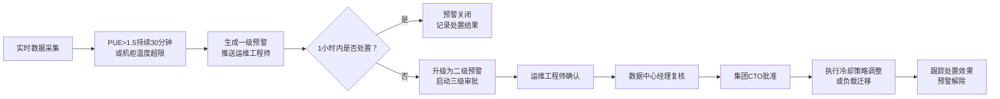
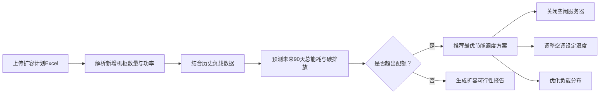

## 1. 产品概述

全国性大型数据中心能效与智能运维分析平台，实时接入全国各机房的服务器负载、冷却系统功率、温湿度传感器及PUE数据流，通过智能分析实现能效优化、故障预警、碳排放管控与智能运维决策支持。

- **核心价值**：降低数据中心PUE、减少碳排放、提升运维效率、保障设备安全运行
- **目标用户**：集团CTO、数据中心经理、运维工程师、能耗管理人员
- **市场定位**：面向大型企业集团的多数据中心统一能效管理平台

## 2. 核心功能

### 2.1 用户角色与权限

| 角色 | 注册方式 | 核心权限 |
|------|---------|----------|
| 集团管理员 | 系统分配 | 查看全国所有机房数据、审批三级预警、配置系统参数 |
| 区域经理 | 系统分配 | 查看所辖区域机房数据、复核二级预警、查看区域能效报告 |
| 机房主管 | 系统分配 | 查看本机房所有数据、确认一级预警、处置告警、查看机房报告 |
| 运维工程师 | 系统分配 | 查看负责机房设备数据、接收预警推送、执行运维操作 |

### 2.2 功能模块

1. **实时监控看板**：全国能效热力图、碳排放排名、核心指标概览、机房下钻分析
2. **预警管理中心**：告警列表、预警详情、处置流程、三级审批
3. **能效分析报表**：PUE趋势、机柜利用率、温度分布、能耗成本分析
4. **扩容规划预测**：Excel上传解析、90天能耗预测、节能方案推荐
5. **权限管理系统**：用户管理、角色配置、数据范围控制
6. **健康报告中心**：周度报告自动生成、同比环比分析、优化建议

### 2.3 页面详情

| 页面名称 | 模块名称 | 功能描述 |
|---------|---------|----------|
| 登录页 | 身份认证 | 账号密码登录、权限校验、会话管理 |
| 总览看板 | 全国概览 | 能效热力图、碳排放排名、核心指标卡片、异常告警提示 |
| 机房详情 | 机房下钻 | 机柜功耗趋势曲线、温度分布箱线图、机房能效指标 |
| 预警中心 | 告警管理 | 告警列表、分级展示、处置记录、审批流程 |
| 能效报表 | 数据分析 | 多维度分析图表、自定义时间范围、数据导出 |
| 扩容预测 | 规划分析 | Excel上传、90天预测、节能方案推荐 |
| 报告中心 | 报告管理 | 周度报告列表、报告详情、历史对比 |
| 系统设置 | 权限管理 | 用户管理、角色配置、阈值参数设置 |

## 3. 核心流程

### 3.1 预警升级流程

### 3.2 扩容预测流程

## 4. 用户界面设计

### 4.1 设计风格
- **设计理念**：科技感、专业、数据驱动的工业风设计
- **主色调**：深海蓝 (#0A1628) 作为背景主色，搭配科技青 (#00D4FF) 作为主交互色
- **辅助色**：预警红 (#FF4757)、警告橙 (#FFA502)、成功绿 (#2ED573)、数据紫 (#A55EEA)
- **字体**：标题使用 Space Grotesk，正文使用 JetBrains Mono，数字使用等宽字体
- **视觉效果**：深色主题、发光效果、数据网格背景、微动效交互

### 4.2 页面设计概述

| 页面名称 | 模块名称 | UI元素 |
|---------|---------|--------|
| 总览看板 | 热力图模块 | 中国地图可视化、城市节点发光、颜色深浅表示能效等级、悬浮显示详情 |
| 总览看板 | 核心指标卡片 | 玻璃拟态卡片、实时数据跳动动画、趋势箭头、环比变化百分比 |
| 机房详情 | 趋势图表 | 双Y轴折线图、7天时间轴、多机柜对比、区间选择器 |
| 机房详情 | 箱线图 | 温度分布可视化、四分位标注、异常值高亮、均值参考线 |
| 预警中心 | 告警列表 | 分级颜色标识、倒计时显示、处置状态标签、紧急程度排序 |
| 预警中心 | 审批流程 | 时间轴展示、审批节点高亮、签名确认、操作日志 |
| 扩容预测 | 上传区域 | 拖拽上传、文件预览、解析进度、数据校验反馈 |
| 报告中心 | 报告卡片 | 封面缩略图、生成时间戳、下载按钮、快速预览 |

### 4.3 响应式设计
- **桌面优先**：针对1920×1080及以上分辨率优化，支持多屏展示
- **平板适配**：1024-1920px，侧边栏可收起，图表自适应缩放
- **移动适配**：768-1024px，简化布局，核心指标优先展示
- **触控优化**：按钮最小44×44px，滑动手势支持图表缩放

### 4.4 数据可视化规范
- **热力图**：使用颜色渐变表示能效等级，蓝→绿→黄→橙→红
- **趋势线**：平滑曲线，数据点高亮，支持多条线对比
- **仪表盘**：半圆仪表盘，指针动画，临界值红区警示
- **排名榜**：条形图动画，前三名特殊标识，支持切换排序维度
