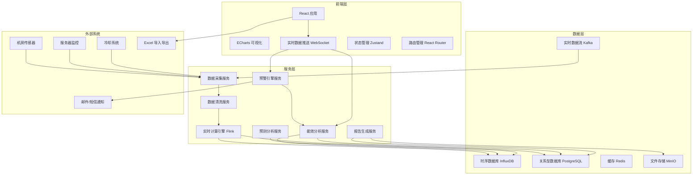
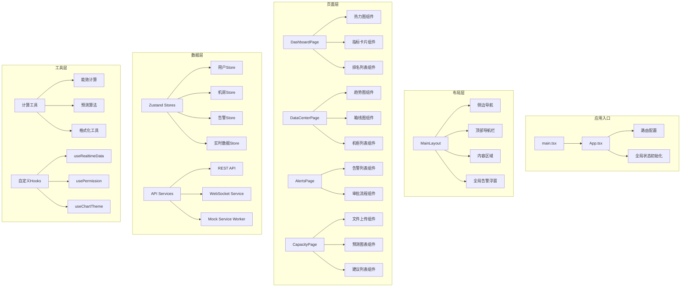

## 1. 架构设计



## 2. 技术栈说明

### 2.1 前端技术栈
- **核心框架**: React 18 + TypeScript 5
- **构建工具**: Vite 5
- **样式方案**: TailwindCSS 3 + SCSS
- **状态管理**: Zustand 4
- **路由管理**: React Router v6
- **图表库**: ECharts 5 + @echarts/react
- **UI组件库**: Ant Design 5
- **地图可视化**: 高德地图 JS API
- **Excel处理**: SheetJS (xlsx)
- **HTTP客户端**: Axios
- **实时通信**: Socket.io-client
- **动画库**: Framer Motion

### 2.2 模拟后端与数据
- **Mock数据**: MSW (Mock Service Worker)
- **数据生成**: Faker.js
- **本地存储**: localStorage + IndexedDB
- **模拟实时流**: setInterval + WebSocket模拟

## 3. 路由定义

| 路由路径 | 页面名称 | 权限要求 |
|---------|---------|---------|
| /login | 登录页 | 公开 |
| /dashboard | 总览看板 | 所有登录用户 |
| /dashboard/:cityId | 城市机房列表 | 对应区域权限 |
| /data-center/:id | 机房详情 | 对应机房权限 |
| /alerts | 预警中心 | 运维工程师及以上 |
| /alerts/:id | 预警详情/审批 | 对应审批权限 |
| /reports | 能效报表 | 机房主管及以上 |
| /capacity | 扩容预测 | 数据中心经理及以上 |
| /health-reports | 健康报告 | 所有登录用户 |
| /health-reports/:id | 报告详情 | 对应权限 |
| /settings | 系统设置 | 集团管理员 |
| /settings/users | 用户管理 | 集团管理员 |
| /settings/roles | 角色权限 | 集团管理员 |
| /settings/thresholds | 阈值配置 | 集团管理员 |

## 4. 核心数据类型定义

```typescript
// 机房数据
interface DataCenter {
  id: string;
  name: string;
  city: string;
  region: string;
  address: string;
  totalRacks: number;
  totalPower: number;
  designPUE: number;
  coordinates: { lat: number; lng: number };
}

// 机柜数据
interface Rack {
  id: string;
  dataCenterId: string;
  name: string;
  row: string;
  position: number;
  ratedPower: number;
  servers: number;
  maxTemp: number;
  minTemp: number;
}

// 实时数据点
interface TelemetryData {
  timestamp: number;
  dataCenterId: string;
  rackId?: string;
  serverLoad: number;
  coolingPower: number;
  temperature: number;
  humidity: number;
  pue: number;
  powerUsage: number;
}

// 能效指标
interface EfficiencyMetrics {
  timestamp: number;
  dataCenterId: string;
  pue: number;
  rackUtilization: number;
  temperatureUniformity: number;
  totalPower: number;
  itPower: number;
  coolingPower: number;
  carbonEmission: number;
}

// 预警信息
interface Alert {
  id: string;
  type: 'PUE_EXCEEDED' | 'TEMPERATURE_HIGH' | 'HUMIDITY_ABNORMAL' | 'POWER_OVERLOAD';
  level: 1 | 2;
  status: 'PENDING' | 'ACKNOWLEDGED' | 'PROCESSING' | 'ESCALATED' | 'RESOLVED' | 'CLOSED';
  dataCenterId: string;
  rackId?: string;
  threshold: number;
  currentValue: number;
  startTime: number;
  escalationTime?: number;
  assignee?: string;
  approvalFlow?: ApprovalStep[];
  resolution?: string;
}

// 审批步骤
interface ApprovalStep {
  id: string;
  level: 1 | 2 | 3;
  role: 'ENGINEER' | 'MANAGER' | 'CTO';
  userId: string;
  status: 'PENDING' | 'APPROVED' | 'REJECTED';
  comment: string;
  timestamp?: number;
}

// 扩容计划
interface ExpansionPlan {
  id: string;
  dataCenterId: string;
  uploadTime: number;
  newRacks: number;
  newPower: number;
  predictedEnergy90d: number;
  predictedCarbon90d: number;
  quotaExceeded: boolean;
  recommendations: EnergySavingRecommendation[];
}

// 节能建议
interface EnergySavingRecommendation {
  id: string;
  type: 'SERVER_SHUTDOWN' | 'AC_TEMPERATURE_ADJUST' | 'LOAD_BALANCING' | 'COOLING_OPTIMIZATION';
  description: string;
  estimatedEnergySaving: number;
  estimatedCarbonSaving: number;
  priority: 'HIGH' | 'MEDIUM' | 'LOW';
}

// 健康报告
interface HealthReport {
  id: string;
  weekNumber: number;
  year: number;
  dataCenterId: string;
  generatedAt: number;
  avgPUE: number;
  pueYoY: number;
  pueMoM: number;
  avgFaultResolutionTime: number;
  energyCostTrend: TrendPoint[];
  optimizationSuggestions: string[];
  maintenancePlan: MaintenanceTask[];
}

// 用户与权限
interface User {
  id: string;
  username: string;
  name: string;
  role: 'GROUP_ADMIN' | 'REGION_MANAGER' | 'DC_MANAGER' | 'ENGINEER';
  region?: string;
  dataCenterIds?: string[];
  email: string;
  phone: string;
}
```

## 5. 前端核心模块架构



## 6. 前端目录结构

```
src/
├── assets/                 # 静态资源
│   ├── fonts/             # 字体文件
│   ├── icons/             # 图标
│   └── images/            # 图片
├── components/            # 公共组件
│   ├── charts/           # 图表组件
│   ├── layout/           # 布局组件
│   ├── ui/               # 基础UI组件
│   └── common/           # 通用业务组件
├── pages/                 # 页面组件
│   ├── Login/
│   ├── Dashboard/
│   ├── DataCenter/
│   ├── Alerts/
│   ├── Reports/
│   ├── Capacity/
│   ├── HealthReports/
│   └── Settings/
├── store/                 # 状态管理
│   ├── userStore.ts
│   ├── dataCenterStore.ts
│   ├── alertStore.ts
│   └── realtimeStore.ts
├── services/              # API服务
│   ├── api.ts
│   ├── websocket.ts
│   └── mock/
├── hooks/                 # 自定义Hooks
│   ├── useRealtimeData.ts
│   ├── usePermission.ts
│   └── useChartTheme.ts
├── utils/                 # 工具函数
│   ├── efficiency.ts
│   ├── prediction.ts
│   ├── formatters.ts
│   └── constants.ts
├── types/                 # 类型定义
│   └── index.ts
├── styles/                # 全局样式
│   ├── index.scss
│   ├── variables.scss
│   └── animations.scss
├── mock/                  # Mock数据
│   ├── dataCenters.ts
│   ├── telemetry.ts
│   └── alerts.ts
├── App.tsx
├── main.tsx
└── vite-env.d.ts
```
